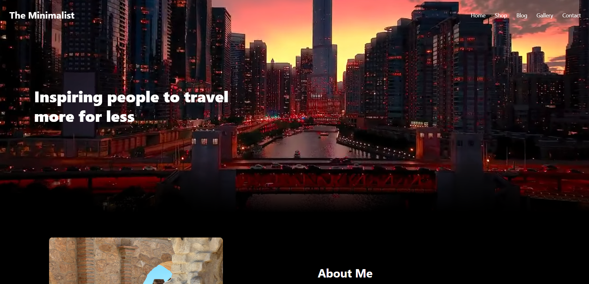
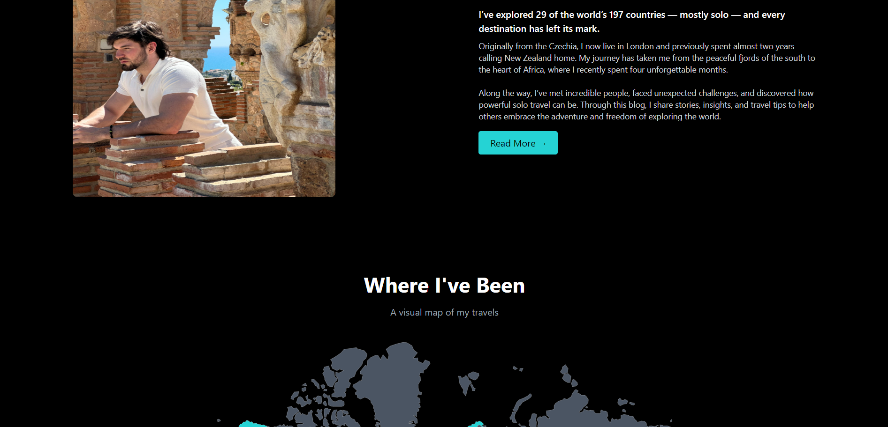
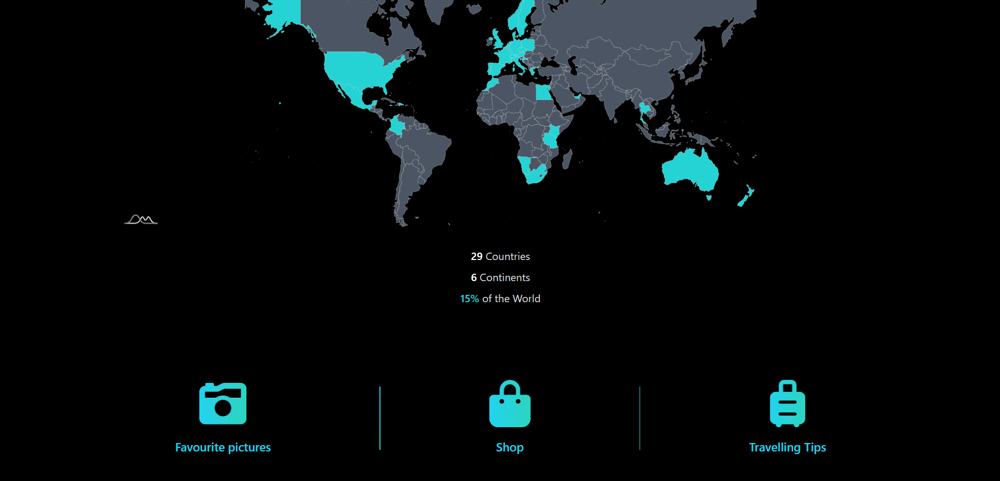
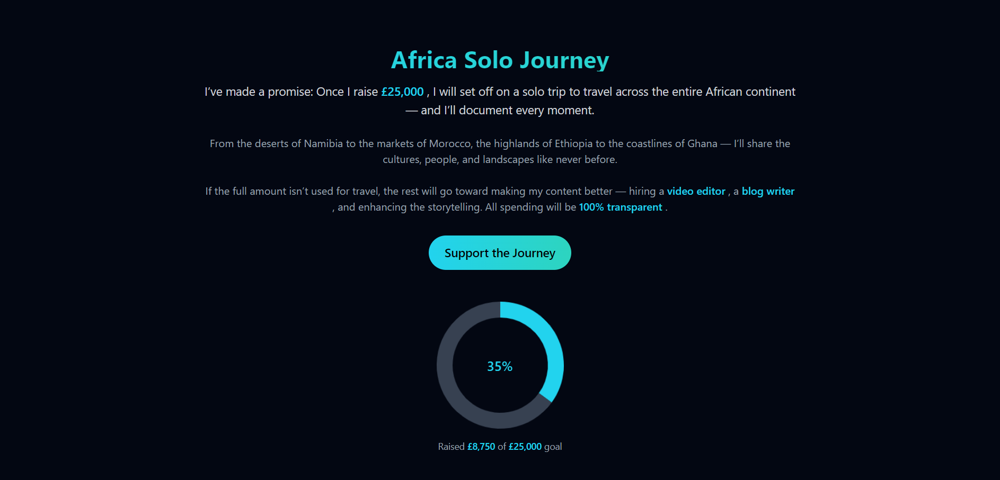
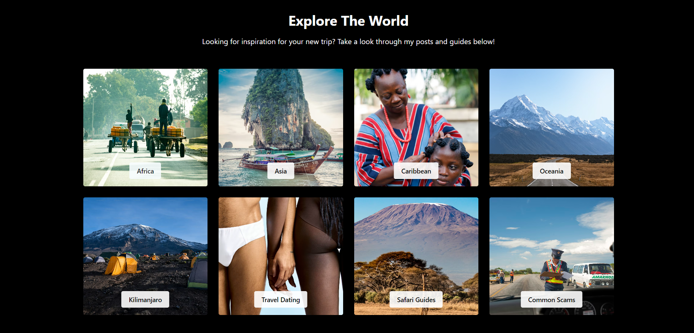
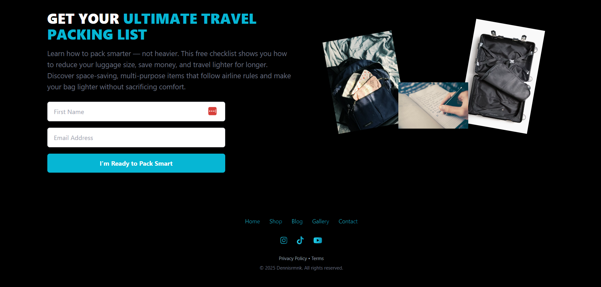

# 🌍 The Minimalist - Travel Blog & Guides

> A visually immersive travel blog showcasing global adventures, favourite destinations, and practical travel tips. Based on my own experiences.








---

## 👀 Why This Project Stands Out

- Dark-themed, modern UI built with Tailwind CSS  
- Hero section with autoplay background video for an immersive experience  
- Interactive world map highlighting visited countries  
- Visual galleries of favourite travel spots  
- Travel guides, packing lists, and curated tips for backpacking  
- Experimenting with multi-page HTML structure with dynamic components (header/footer)  
- Designed as a stepping stone toward a future Next.js project  

---

## 🛠️ Tech Stack

- **HTML5 & CSS** – Core structure and styling  
- **Tailwind CSS** – Utility-first responsive design  
- **JavaScript (Vanilla)** – Dynamic content and DOM manipulation  
- **amCharts 5** – Interactive world map visualization  
- **Chart.js** – Funding progress doughnut chart  
- **EmailJS** – Form submissions for travel packing list  
- **Font Awesome** – Icons throughout the site  

---

## ✨ Features

- Interactive world map highlighting 29 visited countries  
- Background hero video for immersive storytelling  
- Visual galleries and travel guides by continent  
- Travel packing checklist via email form  
- Fundraising progress tracker for upcoming solo African journey  
- Dynamic header/footer components loaded asynchronously  

---

> Each page contains unique content from my personal travels.  

---

## 🧠 What I Learned

- Experimenting with **multi-page HTML projects** and reusable components  
- Integrating **video, maps, charts, and interactive UI**  
- Handling **form submissions with EmailJS**  
- Preparing for future **Next.js conversion**  
- Experimenting with responsive layouts, dark theme, and modern web design  

> 📌 *This project is an experimental travel blog showcasing my hands-on learning. My goal is to eventually rebuild it in Next.js for a scalable and interactive full-stack web experience.*

---

## ⚙️ How to Run Locally

1. Clone the repository  
   ```bash
   git clone https://github.com/FrontEndHighRoller/The-Minimalist.git
2. Open index.html in your browser
3. Resize the screen to see responsive layouts and image switching in action 🎯

---

🏆 Challenge Credit
Challenge by Frontend Mentor
https://www.frontendmentor.io

---

🙋‍♂️ Author
Dennis Rumanek

GitHub: https://github.com/FrontEndHighRoller

LinkedIn: https://www.linkedin.com/in/dennis-rumanek/

⭐ If you like this solution, feel free to star the repository!
